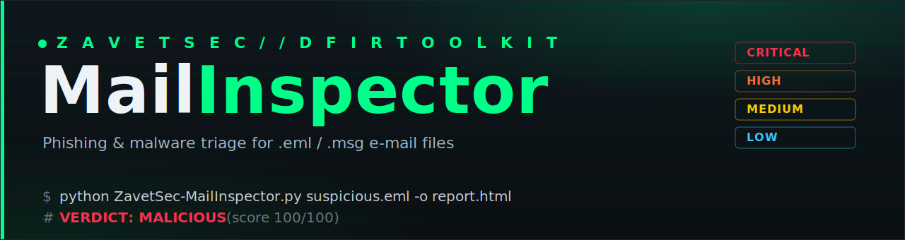
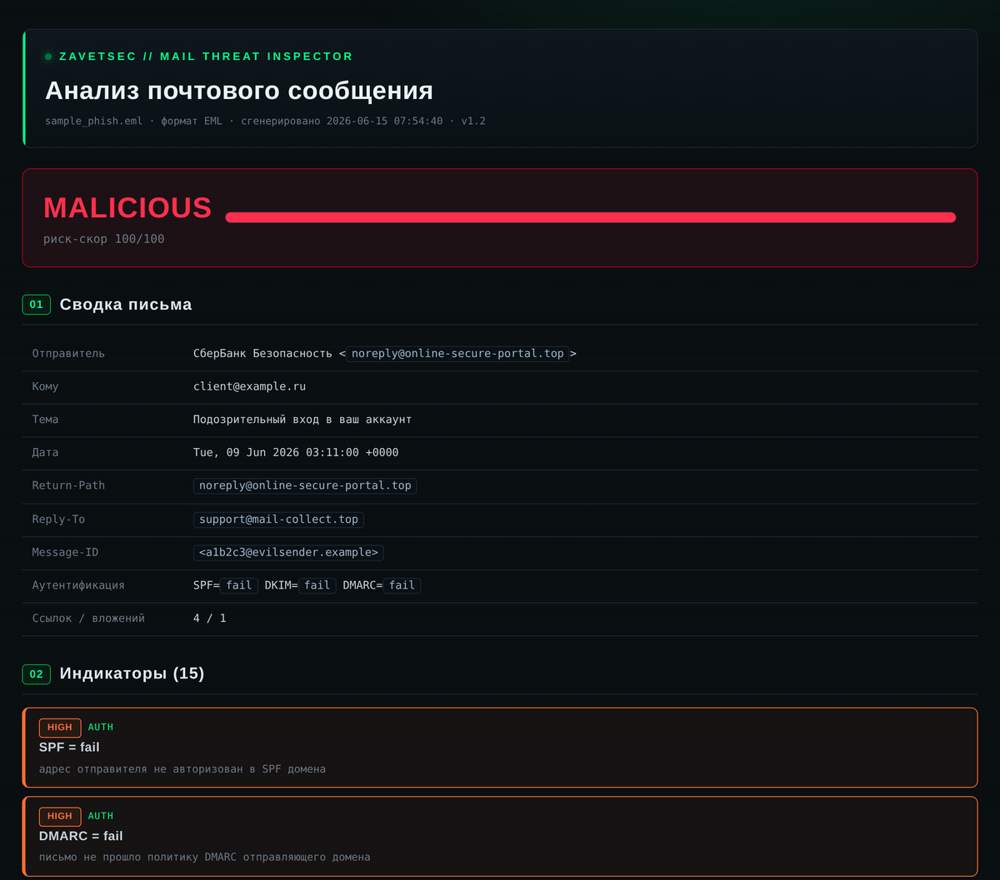
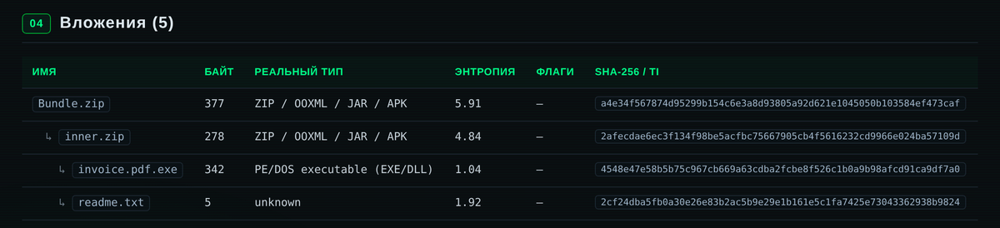

<div align="center">



# ZavetSec‑MailInspector

**Phishing & malware triage for `.eml` and `.msg` e‑mail files.**
A single‑file, dependency‑light DFIR tool that turns a suspicious message into an actionable verdict, a clean IOC list, and a self‑contained HTML report.


</div>

---

## Why

Abuse mailboxes fill up with forwarded `.eml`/`.msg` files, and an L1 analyst has to decide *fast* whether each one is harmless, suspicious, or an active attack. MailInspector automates that first pass and hands back a verdict you can act on — plus a ready‑to‑block IOC list.

- **Two formats, one tool** — RFC822 `.eml` *and* Outlook `.msg`.
- **Runs anywhere** — `.eml` analysis needs **only the Python standard library**.
- **Offline by default** — nothing leaves the machine unless you pass `--online`.
- **Air‑gap‑safe reports** — the HTML report references **zero external resources** (no CDNs, no remote fonts, no tracking), so it won't beacon when you view content derived from an attacker's e‑mail.
- **Automation‑friendly** — JSON output and meaningful exit codes for pipelines and auto‑triage.

---

## Report preview

<div align="center">



*Self‑contained HTML report — verdict, scored findings, IOC block and delivery path. Renders fully offline.*

</div>

---

## How it works

```text
        ┌─────────────┐
        │  .eml / .msg │
        └──────┬──────┘
               ▼
         ┌──────────┐     stdlib email  ·  extract-msg
         │  Parser  │     headers · bodies · attachments
         └────┬─────┘
              ▼
   ┌──────────────────────┐   AUTH · HEADER · URL
   │      Detectors       │   BODY · ATTACH · (TI)
   └──────────┬───────────┘
              ▼
        ┌───────────┐    weighted severities
        │  Scoring  │    → CLEAN / SUSPICIOUS / MALICIOUS
        └─────┬─────┘
              ▼
   ┌────────────────────────────────┐
   │  HTML report · JSON · IOC list │  + exit code
   └────────────────────────────────┘
```

---

## Detection coverage

| Layer | Checks |
|-------|--------|
| **Authentication** | SPF / DKIM / DMARC results · `Received` chain & originating IP |
| **Sender spoofing** | From ↔ Return‑Path ↔ Reply‑To mismatch · foreign address in display‑name · brand impersonation in display‑name · Message‑ID domain mismatch |
| **URLs** | link text ≠ href (link spoofing) · IP‑literal URLs · `user:pass@` host obfuscation · punycode / IDN homographs · **mixed‑script (Latin + Cyrillic/Greek) homoglyphs** · URL shorteners · cheap/abused TLDs · brand‑in‑subdomain · `data:` / `javascript:` schemes |
| **Body** | bilingual (EN + RU) social‑engineering keyword scoring · tracking pixels · hidden text · in‑body HTML forms |
| **Attachments** | MD5 / SHA‑1 / SHA‑256 · **true file type via magic bytes vs. claimed extension** · dangerous & double extensions · **VBA macro detection** (auto‑exec / suspicious, via `oletools`) · **context‑aware Shannon entropy** (packed / obfuscated payloads) · **password‑protected archive detection** (ZIP / RAR / 7z) with **body‑password correlation** |
| **Recursive archives** | **extracts and re‑scans nested content** (ZIP / TAR / GZIP in‑memory; 7z / RAR via optional libs) up to 3 levels deep · **zip‑bomb guards** (depth / file‑count / size budget / compression‑ratio) · every nested file gets the full detector pass and its hash added to the IOC list |
| **Threat intel** | *optional* SHA‑256 lookup against MalwareBazaar + ThreatFox (`--online`) |
| **Output** | risk score → verdict · de‑duplicated IOCs (domains / IPs / URLs / e‑mails / hashes) · delivery path |

### Recursive archive analysis

Malware rarely arrives as a bare `.exe` — it hides inside an archive. MailInspector unpacks containers **in memory** and runs every detector again on each nested file, so an executable buried in a zip‑inside‑a‑zip still surfaces, with its full path shown:

<div align="center">



</div>

Extraction is bounded by depth, file‑count, per‑file and total‑size budgets, and a compression‑ratio check — a **decompression bomb** is stopped and reported rather than detonated. In‑memory handling also sidesteps path‑traversal (zip‑slip) entirely.

---

## Install

```bash
git clone https://github.com/zavetsec/ZavetSec-MailInspector.git
cd ZavetSec-MailInspector

# Core .eml analysis works with zero dependencies.
# For .msg parsing, macro detection and online TI:
pip install -r requirements.txt
```

| Dependency | Enables | Required? |
|------------|---------|-----------|
| `extract-msg` | Outlook `.msg` parsing | optional |
| `oletools` | VBA macro analysis in Office attachments | optional |
| `requests` | online threat‑intel (`--online`) | optional |

Missing a dependency degrades gracefully — the tool tells you what it skipped instead of crashing.

---

## Quick start

```bash
# Single message → HTML + JSON
python ZavetSec-MailInspector.py suspicious.eml -o report.html -j result.json

# Recurse a whole quarantine / abuse folder
python ZavetSec-MailInspector.py ./abuse-inbox/ -o ./reports/

# Outlook message, extract attachments for sandboxing
python ZavetSec-MailInspector.py message.msg --dump ./attachments/

# Enable online hash reputation (sends attachment HASHES to MB/ThreatFox)
python ZavetSec-MailInspector.py invoice.eml --online -o report.html
```

Try it on the included sample:

```bash
python ZavetSec-MailInspector.py examples/sample_phish.eml -o demo.html
```

---

## Example output

```text
┌──────────────────────────────────────────────────────────────────────
│ ZavetSec-MailInspector  v1.0
│ sample_phish.eml  [EML]
└──────────────────────────────────────────────────────────────────────
  From      : Account Security <support@paypal.com>  <noreply@payments-secure-update.xyz>
  Subject   : Urgent: your account has been suspended
  Auth      : SPF=fail  DKIM=fail  DMARC=fail
  URLs      : 4   Attachments: 2

  VERDICT: MALICIOUS  (score 100/100)

  [HIGH]    HEADER: Display-name contains a foreign e-mail
  [HIGH]    URL:    Link text does not match the real address (link spoofing)
  [HIGH]    URL:    Link points to a raw IP address
  [HIGH]    ATTACH: Double file extension  (Invoice_2026.pdf.exe)
  [MEDIUM]  HEADER: Sender name impersonates brand "paypal"
  [MEDIUM]  URL:    URL shortener (real target hidden)
  [MEDIUM]  BODY:   Social-engineering triggers (5)
  ...
```

The HTML report renders all findings, the full URL and attachment tables, the delivery path, and a copy‑paste IOC block — styled in the ZavetSec dark/terminal aesthetic and fully self‑contained (see [report preview](#report-preview) above).

---

## CLI reference

| Option | Description |
|--------|-------------|
| `target` | `.eml` / `.msg` file, or a directory to walk recursively |
| `-o, --html PATH` | write the HTML report (for a directory target, a reports folder) |
| `-j, --json PATH` | write machine‑readable JSON |
| `--dump DIR` | extract attachments to `DIR` (named `sha256_filename`) |
| `--online` | enable MalwareBazaar + ThreatFox hash lookups (**sends hashes externally**) |
| `--no-color` | disable ANSI colour in console output |
| `--quiet` | suppress per‑finding console output |

### Exit codes

| Code | Meaning | Use |
|------|---------|-----|
| `0` | clean | nothing to do |
| `1` | suspicious / likely malicious | route to analyst |
| `2` | malicious | escalate / auto‑quarantine |

For a directory the exit code reflects the **worst** message in the batch — drop it straight into a mail‑gateway hook or cron‑driven abuse‑mailbox triage.

---

## How scoring works

Every finding carries a severity (`INFO` → `CRITICAL`) with a weight. Weights are summed with diminishing returns per category (so ten low‑value URLs can't inflate a verdict on their own) and capped at 100:

| Score | Verdict |
|-------|---------|
| `0 – 17` | **CLEAN** |
| `18 – 39` | **SUSPICIOUS** |
| `40 – 69` | **LIKELY MALICIOUS** |
| `70 – 100` | **MALICIOUS** |

Thresholds and keyword/brand/TLD lists live at the top of the script — tune them to your environment without touching the logic.

---

## Integrating into a SOC workflow

**Auto‑triage an abuse mailbox** (save reports, JSON for your SIEM, exit code for routing):

```bash
for f in /var/spool/abuse/*.eml; do
  python ZavetSec-MailInspector.py "$f" \
    -o "/var/www/reports/$(basename "$f").html" \
    -j "/var/log/mailinspect/$(basename "$f").json" --quiet
  rc=$?
  [ "$rc" -eq 2 ] && mv "$f" /var/spool/abuse/malicious/
done
```

The JSON carries every finding, all IOCs, attachment hashes and the delivery path — ingest it for correlation, hash‑blocking, or feeding a watchlist.

---

## Design & OPSEC notes

- **No external references in the report.** URLs from the e‑mail are rendered as inert text, never as live `<a href>`/``. Open reports on an isolated host with confidence.
- **Offline first.** Threat‑intel lookups are opt‑in (`--online`); without it, nothing leaves the machine.
- **System fonts only.** No remote font loading — the report renders consistently offline and stays self‑contained.

---

## Building a standalone binary

For analysts without Python, build a portable artifact (scripts in [`build/`](build/)):

```bash
# Cross-platform single-file zipapp (portable, AV-friendly)
make pyz        # or: build/build.sh pyz

# Windows .exe (PyInstaller) — keep internal, allowlist by SHA-256 in your EDR
build\build.ps1
```

> A standalone `.exe` is convenient for endpoints but is commonly heuristically flagged by AV/EDR. The recommended distribution is the `.py` (auditable) or `.pyz` (portable, AV‑friendly). See [`build/`](build/) for details.

---

## Roadmap

- [ ] **ARC** chain validation (`Authentication-Results` survivability across hops)
- [ ] **S/MIME & PGP** detection — signature presence, validity, and signer/sender mismatch
- [ ] **QR‑code extraction & decoding** (quishing) from inline images and PDFs
- [ ] YARA scanning of attachments (custom rule file)
- [ ] **STIX 2.1** IOC export and aggregate batch dashboard

**Shipped in v1.1:** context‑aware attachment entropy · password‑protected archive detection with body‑password correlation.
**Shipped in v1.2:** recursive archive extraction (ZIP / TAR / GZIP / 7z / RAR) with zip‑bomb guards and full nested re‑scan.

---

## Contributing

Issues and PRs welcome — detection rules, new magic signatures, brand/keyword additions, and false‑positive reports are especially useful. Keep changes self‑contained and dependency‑light; the design goals are *auditable, portable, offline‑capable*.

---

## Disclaimer

MailInspector is a **defensive** tool for analysts with authorization to inspect the messages they process. It performs static analysis only and is not a substitute for sandbox detonation or full malware reversing. No warranty — see [LICENSE](LICENSE).

---

<div align="center">

**ZavetSec** · part of the ZavetSec DFIR toolkit
Released under the [MIT License](LICENSE)

</div>
